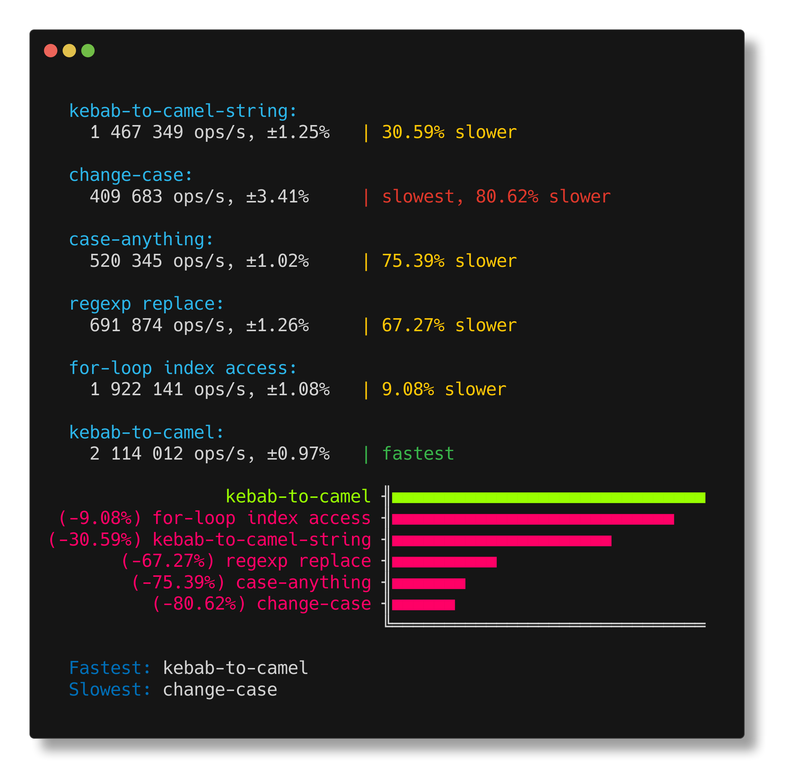

<h1 align="center">kebab-to-camel</h1>

<p align="center">
convert kebab-case to camelCase
</p>

<p align="center">
   <a href="#install">        🔧 <strong>Install</strong></a>
 · <a href="#example">        🧩 <strong>Example</strong></a>
 · <a href="#bench">          🚴 <strong>Bench</strong></a>
 · <a href="#api">            📜 <strong>API docs</strong></a>
 · <a href="https://github.com/stagas/kebab-to-camel/releases"> 🔥 <strong>Releases</strong></a>
 · <a href="#contribute">     💪🏼 <strong>Contribute</strong></a>
 · <a href="https://github.com/stagas/kebab-to-camel/issues">   🖐️ <strong>Help</strong></a>
</p>

---

## Install

```sh
$ npm i kebab-to-camel
```

## Example

```ts
import { kebabToCamel } from 'kebab-to-camel'

console.log(kebabToCamel('hello-camel-world'))
// => helloCamelWorld
```

## Bench

`kebab-to-camel` performs best among the top downloaded packages in **npm** and is probably the fastest way to do it if you just want that conversion and not any-to-camel:



## API

<!-- Generated by documentation.js. Update this documentation by updating the source code. -->

#### Table of Contents

- [kebabToCamel](#kebabtocamel)

### kebabToCamel

[src/index.ts:7-18](https://github.com/stagas/kebab-to-camel/blob/c300f7e7184d85dae798c43e8699c98809fc2f4b/src/index.ts#L7-L18 'Source code on GitHub')

Converts a string from `kebab-case` to `camelCase`.

#### Parameters

- `input` **[string](https://developer.mozilla.org/docs/Web/JavaScript/Reference/Global_Objects/String)** The string in `kebab-case` to be converted

Returns **[string](https://developer.mozilla.org/docs/Web/JavaScript/Reference/Global_Objects/String)** The string in `camelCase`

## Contribute

[Fork](https://github.com/stagas/kebab-to-camel/fork) or
[edit](https://github.dev/stagas/kebab-to-camel) and submit a PR.

All contributions are welcome!

## License

MIT © 2021
[stagas](https://github.com/stagas)
